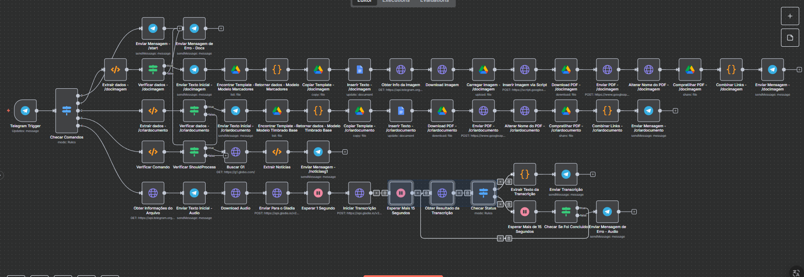

# 🤖 n8n-telegram-multitool-bot

Bot multifuncional no Telegram construído com **n8n**, capaz de gerar documentos PDF (com e sem imagem), buscar notícias em tempo real e transcrever áudios automaticamente — tudo orquestrado em um único workflow low-code.

> Projeto desenvolvido como estudo de caso técnico durante um processo seletivo de estágio, com foco em automação de processos (RPA) usando n8n integrado ao Telegram, Google Docs/Drive e APIs externas.


---

## 📌 Sobre o projeto

Este repositório documenta um workflow de automação criado no **n8n** que transforma um bot do Telegram em um assistente capaz de executar **4 casos de uso** distintos, escolhidos para demonstrar domínio de integração entre APIs, tratamento de erros, manipulação de arquivos e lógica condicional em ambiente low-code.

O workflow completo tem **53 nós** organizados em 5 fluxos principais, todos disparados por um único `Telegram Trigger` e roteados por um nó de roteamento de comandos (`Checar Comandos`).

## ✅ Casos de uso implementados

| # | Comando | O que faz |
|---|---------|-----------|
| 1 | `/criardocumento <texto>` | Gera um documento PDF a partir de um texto enviado no chat, usando um template timbrado do Google Docs, e devolve o link/arquivo pelo Telegram |
| 2 | `/docimagem <texto + imagem>` | Mesmo fluxo do caso 1, mas insere também uma imagem enviada pelo usuário dentro do PDF gerado |
| 3 | `/noticiasg1` | Faz scraping da página do G1 e retorna as últimas notícias do portal diretamente no chat |
| 4 | Envio de áudio | Detecta um áudio enviado ao bot, envia para a API da **Gladia** e retorna a transcrição em texto assim que o processamento é concluído |

Além dos casos de uso, o workflow inclui:
- 🧯 **Tratamento de erros** dedicado para os fluxos de documentos e de áudio
- ⏳ **Polling assíncrono** (esperas de 1s e 15s + verificação de status) para aguardar a conclusão da transcrição na Gladia
- 📎 Geração de link de compartilhamento do PDF via Google Drive
- 🧭 Roteamento de comandos centralizado, com fallback de ajuda (`/start`)

## 🖼️ Visão geral do workflow



*Visão completa do fluxo no editor do n8n — 5 ramificações a partir do Telegram Trigger, uma para cada comando/tipo de mensagem.*

## 🏗️ Arquitetura

```
Telegram Trigger
      │
      ▼
Checar Comandos (roteador)
      │
      ├── /start ──────────► Enviar mensagem de boas-vindas e lista de comandos
      │
      ├── /docimagem ──────► Extrair dados → Validar → Buscar template (Google Docs)
      │                       → Inserir texto e imagem → Gerar PDF → Renomear
      │                       → Compartilhar (Drive) → Enviar link no Telegram
      │
      ├── /criardocumento ─► Extrair dados → Validar → Buscar template (Google Docs)
      │                       → Inserir texto → Gerar PDF → Renomear
      │                       → Compartilhar (Drive) → Enviar link no Telegram
      │
      ├── /noticiasg1 ─────► Buscar HTML do G1 → Extrair notícias → Enviar no chat
      │
      └── Áudio recebido ──► Baixar áudio → Enviar para Gladia → Aguardar (polling)
                              → Checar status → Extrair transcrição → Enviar no chat
                                                       └─(erro)─► Enviar mensagem de erro
```

## 🧰 Stack e integrações

- **[n8n](https://n8n.io/)** — orquestração do workflow (self-hosted ou cloud)
- **Telegram Bot API** — interface de entrada/saída com o usuário
- **Google Docs API** (via Apps Script) — templates de documento e inserção de imagem
- **Google Drive API** — armazenamento e compartilhamento dos PDFs gerados
- **[Gladia API](https://www.gladia.io/)** — transcrição de áudio para texto (speech-to-text)
- **HTTP Request / Web Scraping** — coleta de notícias do G1

## 📂 Estrutura do repositório

```
n8n-telegram-multitool-bot/
├── workflow.n8n.json        # Export do workflow (sanitizado, sem credenciais)
├── docs/
│   └── workflow-overview.png  # Print do canvas do n8n
├── README.md
├── LICENSE
└── .gitignore
```

## ⚙️ Como importar e rodar

1. Tenha uma instância do n8n rodando ([n8n.io](https://n8n.io) cloud ou self-hosted).
2. No editor do n8n, vá em **Workflows → Import from File** e selecione `workflow.n8n.json`.
3. Configure as credenciais necessárias (o arquivo vem **sem** chaves reais, apenas placeholders):
   - `Telegram API` — crie um bot com o [@BotFather](https://t.me/BotFather) e adicione o token
   - `Google Docs OAuth2` / `Google Drive OAuth2` — conecte sua conta Google
   - Chave de API da **Gladia** — cadastre-se em [gladia.io](https://www.gladia.io/) e insira sua chave no nó `Enviar Para o Gladia`
4. Duplique/adapte os templates do Google Docs referenciados nos nós `Encontrar Template`.
5. Ative o workflow e converse com o bot no Telegram.

> ⚠️ **Nunca commite tokens ou chaves de API reais.** Use as *credentials* do próprio n8n (que ficam criptografadas na instância) em vez de hardcodar valores nos nós.

## 🧠 Principais aprendizados

- Estruturação de um workflow low-code complexo com múltiplas ramificações e reuso de sub-fluxos
- Integração de APIs assíncronas (padrão *poll até concluir*) com a Gladia
- Manipulação de documentos do Google Docs/Drive via Apps Script a partir do n8n
- Tratamento de erros e mensagens de fallback para o usuário final
- Documentação técnica de um processo de automação ponta a ponta

## 🚧 Possíveis melhorias futuras

- [ ] Substituir o polling fixo por *webhooks* da Gladia (quando disponível), reduzindo espera
- [ ] Adicionar testes automatizados de regressão para os fluxos críticos
- [ ] Internacionalizar as mensagens do bot (pt-BR / en)
- [ ] Adicionar logging estruturado e monitoramento de execuções com falha

## 👤 Autor

**Jameson Henrique**
Desenvolvedor em formação, com foco em automação de processos e integrações low-code.

- LinkedIn: _adicione o link do seu perfil aqui_
- GitHub: _adicione o link do seu perfil aqui_

---

<p align="center">Feito com 🧠 e 💡 estudando automação com n8n.</p>
